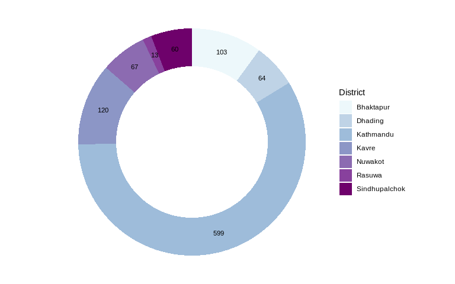
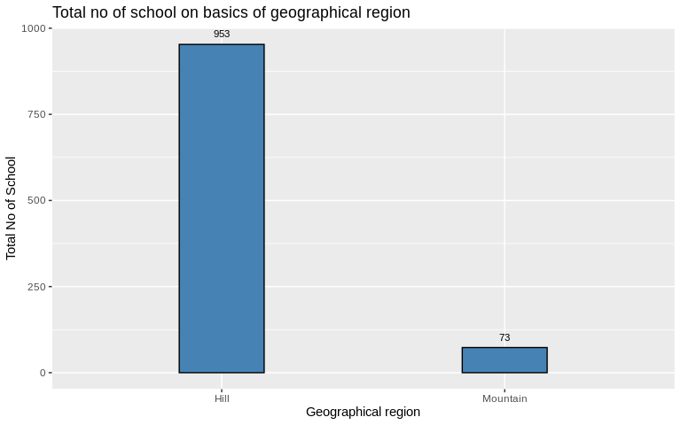
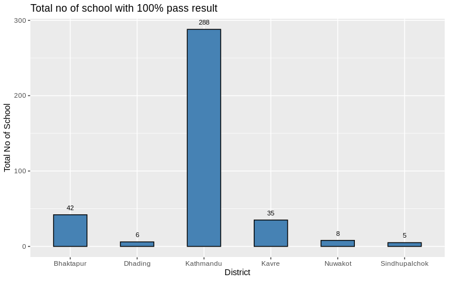
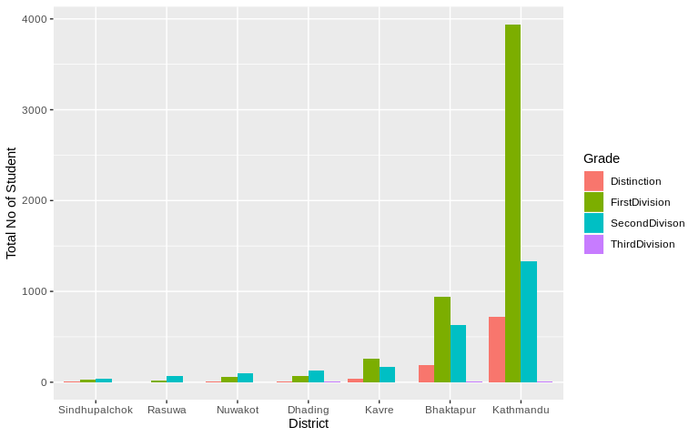
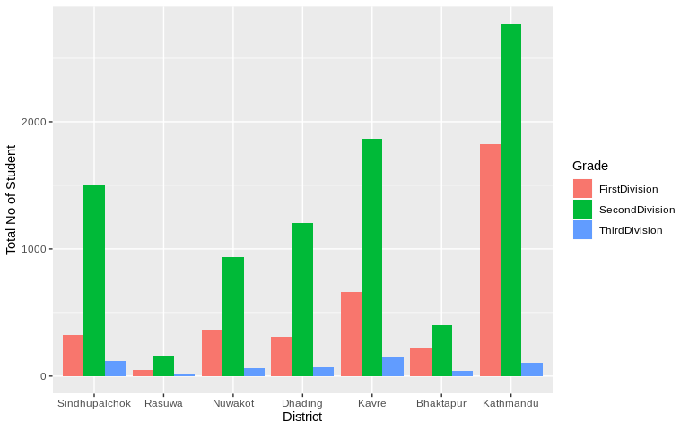

## School performance for the year 2063 BS

This dataset includes the school performance data for the year 2063 BS based on the average scores and pass percentage in School Leaving Certificate (SLC) examination of Bagmati zone, an examination marking the completion of grade 10.

## General summary of column used in data set

```r
str(data)
```

```
## 'data.frame':	1026 obs. of  11 variables:
##  $ District           : chr  "Sindhupalchok" "Sindhupalchok" "Sindhupalchok" "Sindhupalchok" ...
##  $ Geographical.Region: chr  "Mountain" "Mountain" "Mountain" "Mountain" ...
##  $ Name.of.School     : chr  "PRIVATE SINDHUPALCHOK" "KRISHNA RATNA GANGA MA VI CHAUTARA" "ANANDA MA VI JALBIR" "SARASWATI MA VI GYALTHUM" ...
##  $ DISTINCTION        : int  0 0 0 0 0 5 0 0 0 0 ...
##  $ FIRST.DIVISION     : int  0 10 10 13 10 24 14 7 3 28 ...
##  $ SECOND.DIVISION    : int  3 83 38 73 39 41 110 22 37 59 ...
##  $ THIRD.DIVISION     : int  1 2 1 7 1 1 16 0 7 5 ...
##  $ PASS               : int  4 95 49 93 50 71 140 29 47 92 ...
##  $ FAIL               : int  2 37 2 17 16 24 33 19 9 10 ...
##  $ PASS.PERCENT       : num  66.7 72 96.1 84.5 75.8 74.7 80.9 60.4 83.9 90.2 ...
##  $ FAIL.PERCENTAGE    : num  33.3 28 3.9 15.5 24.2 ...
```

## Filtering unique districts of Bagmati Zone


```
## [1] "Sindhupalchok" "Rasuwa"        "Nuwakot"       "Dhading"      
## [5] "Kavre"         "Bhaktapur"     "Kathmandu"
```

## Bargraph showing total no of student on basics of district
<div data-pagedtable="false">
  <script data-pagedtable-source type="application/json">
{"columns":[{"label":["District"],"name":[1],"type":["fctr"],"align":["left"]},{"label":["Distinction"],"name":[2],"type":["int"],"align":["right"]},{"label":["FirstDivision"],"name":[3],"type":["int"],"align":["right"]},{"label":["SecondDivision"],"name":[4],"type":["int"],"align":["right"]},{"label":["ThirdDivision"],"name":[5],"type":["int"],"align":["right"]},{"label":["Pass"],"name":[6],"type":["int"],"align":["right"]},{"label":["Fail"],"name":[7],"type":["int"],"align":["right"]},{"label":["Total"],"name":[8],"type":["int"],"align":["right"]}],"data":[{"1":"Rasuwa","2":"1","3":"67","4":"225","5":"14","6":"307","7":"170","8":"477"},{"1":"Sindhupalchok","2":"5","3":"383","4":"1599","5":"122","6":"2109","7":"862","8":"2971"},{"1":"Nuwakot","2":"14","3":"494","4":"1057","5":"64","6":"1629","7":"1542","8":"3171"},{"1":"Dhading","2":"11","3":"448","4":"1342","5":"73","6":"1874","7":"1485","8":"3359"},{"1":"Bhaktapur","2":"447","3":"1991","4":"1118","5":"47","6":"3603","7":"1105","8":"4708"},{"1":"Kavre","2":"190","3":"1607","4":"2118","5":"153","6":"4068","7":"1557","8":"5625"},{"1":"Kathmandu","2":"2173","3":"11710","4":"4718","5":"118","6":"18719","7":"3643","8":"22362"}],"options":{"columns":{"min":{},"max":[10]},"rows":{"min":[10],"max":[10]},"pages":{}}}
  </script>
</div><div class="figure" style="text-align: c">

<p class="caption">Fig 1:- Total No of Student in each district</p>
</div>

## No of school basics of district and geographical region {.tabset .tabset-fade}

### District

<div data-pagedtable="false">
  <script data-pagedtable-source type="application/json">
{"columns":[{"label":["data$District"],"name":[1],"type":["chr"],"align":["left"]},{"label":["n"],"name":[2],"type":["int"],"align":["right"]}],"data":[{"1":"Rasuwa","2":"13"},{"1":"Sindhupalchok","2":"60"},{"1":"Dhading","2":"64"},{"1":"Nuwakot","2":"67"},{"1":"Bhaktapur","2":"103"},{"1":"Kavre","2":"120"},{"1":"Kathmandu","2":"599"}],"options":{"columns":{"min":{},"max":[10]},"rows":{"min":[10],"max":[10]},"pages":{}}}
  </script>
</div>
<!-- -->

### Geographical region

<div data-pagedtable="false">
  <script data-pagedtable-source type="application/json">
{"columns":[{"label":["data$Geographical.Region"],"name":[1],"type":["chr"],"align":["left"]},{"label":["n"],"name":[2],"type":["int"],"align":["right"]}],"data":[{"1":"Mountain","2":"73"},{"1":"Hill","2":"953"}],"options":{"columns":{"min":{},"max":[10]},"rows":{"min":[10],"max":[10]},"pages":{}}}
  </script>
</div>
<!-- -->

## No of school having 100 percent pass result
<div data-pagedtable="false">
  <script data-pagedtable-source type="application/json">
{"columns":[{"label":["District"],"name":[1],"type":["chr"],"align":["left"]},{"label":["Name.of.School"],"name":[2],"type":["chr"],"align":["left"]}],"data":[{"1":"Sindhupalchok","2":"JHIRPU MA VI JHIRPU"},{"1":"Sindhupalchok","2":"JYUGAL BOARDING HIGH SCHOOL CHAUTARA"},{"1":"Sindhupalchok","2":"KOLDONG DEVI MA VI THUMPAKHAR TIMURE"},{"1":"Sindhupalchok","2":"PHULPINGKOT PRA MA VI PHULPINGKOT"},{"1":"Sindhupalchok","2":"SHREE MELAMCHI GHYANG SECONDARY SCHOOL,HELAMBU"},{"1":"Nuwakot","2":"GOLFU BHANJYANG MA VI BETINI"},{"1":"Nuwakot","2":"PIONEER ENGLISH MA VI TUPCHHE"},{"1":"Nuwakot","2":"SOUVENIR BOARDING SCHOOL BATTAR"},{"1":"Nuwakot","2":"UTTARGAYA PUBLIC ENGLISH SCHOOL ANGITAR NEWAKOT"},{"1":"Nuwakot","2":"UNIVERSAL BOARDING SCHOOL NARJAMANDAP-2"},{"1":"Nuwakot","2":"SHIVALAYA SECONDARY SCHOOL OKHARPAUWA"},{"1":"Nuwakot","2":"SURYA JYOTI ENGLISH BOARDINGH SCHOOL BIDUR 9"},{"1":"Nuwakot","2":"SAMUDAYIK VIDHYA MANDIR DEVIGHAT"},{"1":"Dhading","2":"DHADING BOARDING SCHOOL DHADING BENSI"},{"1":"Dhading","2":"BRIGHT FUTURE MA VI MALEKHU"},{"1":"Dhading","2":"SUNGABHA ACADEMY MA VI DHADINGBESI"},{"1":"Dhading","2":"BLOOMING LOTUS ENGLISH SCHOOL JEVANPUR DHADING"},{"1":"Dhading","2":"DHUNIBESHI SECONDARY BOARDING SCHOOL KHANIKHOLA-2 NA"},{"1":"Dhading","2":"KIBOU INTERNATIONAL SCHOOL DHADING"},{"1":"Kavre","2":"DIPENDRA PRAHARI AWASIYA MA VI SANGA"},{"1":"Kavre","2":"PRAGATI PRABHAT MA VI PULBAZAR"},{"1":"Kavre","2":"DULALESWOR MA VI DOLALGHAT"},{"1":"Kavre","2":"SIDDHARTHA ENGLISH MA VI BANEPA"},{"1":"Kavre","2":"KAVERE MA VI BANEPA"},{"1":"Kavre","2":"SETIDEVI MA VI CHAUBAS-9"},{"1":"Kavre","2":"SETIDEVI MA VI RITHTHE"},{"1":"Kavre","2":"NAVA RATNA ENGLISH MA VI PANUTI"},{"1":"Kavre","2":"BAL BATIKA BIDHYA MANDIR TINDOBATO BANEPA"},{"1":"Kavre","2":"SIDDHARTHA VANASTHALI INSTITUTE AANANDABATIKA PANAUTI"},{"1":"Kavre","2":"DHULIKHEL ENGLISH AWASIYA MA VI DHULIKHEL"},{"1":"Kavre","2":"MOUNT VIEW ENGLISH BOARDING SCHOOL DHULIKHEL"},{"1":"Kavre","2":"SANJIWANI ENGLISH SCHOOL DHULIKHEL"},{"1":"Kavre","2":"GYAN SAROVAR MA VI BANEPA"},{"1":"Kavre","2":"BAL NIKETAN MA VI BANEPA"},{"1":"Kavre","2":"NAMO BUDDHA ENGLISH BOARDING SCHOOL SHANKHU"},{"1":"Kavre","2":"SURYODAYA AWASIYA MA VI PANAUTI"},{"1":"Kavre","2":"ARUNODAYA ENGLISH AWASIYA MA VI PANAUTI"},{"1":"Kavre","2":"SARASWOTI KUNJ BOARDING SCHOOL PANAUTI"},{"1":"Kavre","2":"LIN INTERNATIONAL SCHOOL BANEPA"},{"1":"Kavre","2":"DIVINE LIGHT SECONDARY BOARDING ENGLISH SCHOOL SHANKH"},{"1":"Kavre","2":"KATHMANDU UNIVERSITY HIGH SCHOOL CHAUKOT KAVRE"},{"1":"Kavre","2":"SARASWATI SHIKSHA GRIHA SECONDARY SCHOOL PANCHKHAL"},{"1":"Kavre","2":"SAMUDAYIK BOARDING SCHOOL PANAUTI-4"},{"1":"Kavre","2":"BANEPA VALLEY BOARDING SCHOOL BANEPA-10"},{"1":"Kavre","2":"SOS HERMANN GMEINER SCHOOL  PANAUTI-2"},{"1":"Kavre","2":"GYANJYOTI BOARDING SCHOOL NALA"},{"1":"Kavre","2":"GYNA KUNJ SECONDARY SCHOOL JANAGAL"},{"1":"Kavre","2":"HIGHLAND ENGLISH SECONDARY BOARDING SCHOOL SUBBAGAU"},{"1":"Kavre","2":"SHREE SUNGANA ENGLISH BOARDING SCHOOL JANGAL 8"},{"1":"Kavre","2":"NAVA PRATIVA SECONDARY SCHOOL PACHKHAL"},{"1":"Kavre","2":"MOUNT GRAVATT ENGLISH BOARDING SCHOOL BUCHAKOT"},{"1":"Kavre","2":"LALI GURANS ENGLISH BOARDING SCHOOL KUSHADEVI"},{"1":"Kavre","2":"NEW LITTLE STAR ENGLISH SCHOOL KUNTABESHI"},{"1":"Kavre","2":"EVEREST ACADEMY BANEPA"},{"1":"Bhaktapur","2":"OM MA VI KATUNJE"},{"1":"Bhaktapur","2":"ADARSHA JANAPREMI ENGLISH MA VI KAUSHALTAR"},{"1":"Bhaktapur","2":"BALKOT ENGLISH MA VI BALKOT"},{"1":"Bhaktapur","2":"EVEREST ENGLISH SCHOOL BHAKTAPUR-15 MIBACHHEN"},{"1":"Bhaktapur","2":"MAHENDRA VIDYA ASHRAM BARAHISTHAN"},{"1":"Bhaktapur","2":"RAINBOW ENGLISH SECONDARY SCHOOL GAMCHA"},{"1":"Bhaktapur","2":"MOUNT SINAI ENGLISH BOARDING SECONDARY SCHOOL THIMI"},{"1":"Bhaktapur","2":"PRABHAT ENGLISH MA VI BYASI"},{"1":"Bhaktapur","2":"NAULO JYOTI ENGLISH SCHOOL THIMI"},{"1":"Bhaktapur","2":"MOUNT VALLEY ENGLISH SCHOOL KWATHANDOU"},{"1":"Bhaktapur","2":"TRI STAR ENGLISH SCHOOL LOKHANTHALI"},{"1":"Bhaktapur","2":"JANA CHETANA ENGLISH SCHOOL BALKOT"},{"1":"Bhaktapur","2":"OM GYAN MANDIR SCHOOL LOHAKILTHALI"},{"1":"Bhaktapur","2":"GUNDU ENGLISH MA VI GUNDU"},{"1":"Bhaktapur","2":"SIRU SHINING ENGLISH MA VI BHAKTAPUR"},{"1":"Bhaktapur","2":"DADHIKOT ENGLISH MA VI DADHIKOT"},{"1":"Bhaktapur","2":"MOUNT VIEW ENGLISH MA VI BALKOT"},{"1":"Bhaktapur","2":"NYATAPOLA AWASIYA MA VI MOOLDHOKA"},{"1":"Bhaktapur","2":"DIBYA DEEP JYOTI ENGLISH AWASIYA MA VI LOHAKINTHAL"},{"1":"Bhaktapur","2":"JAYCEES ENGLISH SCHOOL KHAUMA"},{"1":"Bhaktapur","2":"SIDDHARTHA VIDYAPEETH MA VI GATTHAGHAR"},{"1":"Bhaktapur","2":"NORTH EAST ENGLISH SCHOOL DUWAKOT"},{"1":"Bhaktapur","2":"DEEP SARASWATI ENGLISH MA VI CHHALING PIKHEL"},{"1":"Bhaktapur","2":"VINAYAK SHIKSHA NIKETAN ENGLISH SCHOOL CHAPACHO"},{"1":"Bhaktapur","2":"SUNSHINE SCHOOL DUDHPATI-17"},{"1":"Bhaktapur","2":"CHILD NATURE SCHOOL SANOTHIMI-17"},{"1":"Bhaktapur","2":"MODERN BOARDING SCHOOL DADHIKOT-9"},{"1":"Bhaktapur","2":"GLAD STONE ACADEMY THIMI"},{"1":"Bhaktapur","2":"SUPREME ACADEMY THIMI"},{"1":"Bhaktapur","2":"SAMAJ SUDHAR SECONDARY SCHOOL TAULACHHEN"},{"1":"Bhaktapur","2":"SARASWATIMATA(YUMAHANGMA) ENGLISH SCHOOL CHANGUNAR"},{"1":"Bhaktapur","2":"NABIN ENGLISH SCHOOL JHAUKHEL-4"},{"1":"Bhaktapur","2":"THE RISING ENGLISH SECONDARY SCHOOL YACHHENTOLE"},{"1":"Bhaktapur","2":"HOLY GARDEN ENGLISH SCHOOL BYASI-10"},{"1":"Bhaktapur","2":"EMMANUEL SECONDARY BOARDING SCHOOL GATTHAGHAR"},{"1":"Bhaktapur","2":"STANFORD INTERNATIONAL SCHOOL BALKOT"},{"1":"Bhaktapur","2":"CHARKHANDI VIDHYA MANDIR SIRUTAR-9"},{"1":"Bhaktapur","2":"BIRAT ENGLISH SCHOOL SANOTHIMI"},{"1":"Bhaktapur","2":"MARIGOLD ENGLISH BOARDING SCHOOL BALKOT"},{"1":"Bhaktapur","2":"NAWA RATNA ENGLISH SCHOOL MADHYAPUR THIMI"},{"1":"Bhaktapur","2":"BAL BIKAS ENGLISH SECONDARY SCHOOL"},{"1":"Bhaktapur","2":"HOLY GARDEN ENGLISH SECONDARY SCHOOL THIMI"},{"1":"Kathmandu","2":"KANTI BHAIRAV MA VI DANCHHI"},{"1":"Kathmandu","2":"SHAHID SMARAK MA VI GYANESWAR"},{"1":"Kathmandu","2":"N.K. SINGH MEMORIAL ENGLISH PREPARATORY SCHOOL NAYA BA"},{"1":"Kathmandu","2":"BALKUMARI AWASIYA MA VI NAXAL"},{"1":"Kathmandu","2":"BABA BOARDING MA VI CHABHIL"},{"1":"Kathmandu","2":"GEETA MATA MA VI BIJESWORI"},{"1":"Kathmandu","2":"TAUDAHA RASTRIYA MA VI TAUDAH"},{"1":"Kathmandu","2":"BAGH BHAIRAB BOARDING MA VI KIRTIPUR"},{"1":"Kathmandu","2":"NAMGYAL MA VI GOKARNA"},{"1":"Kathmandu","2":"DEEPJYOTI AWASIYA MA VI GONGABU"},{"1":"Kathmandu","2":"JUDDHODAYA MA VI CHHETRAPATI"},{"1":"Kathmandu","2":"DORJI MA VI BAUDDHA"},{"1":"Kathmandu","2":"WHITEFIELD HIGHER SECONDARY SCHOOL CHHETRAPATI BHURU"},{"1":"Kathmandu","2":"KANYA MA VI LAINCHAUR"},{"1":"Kathmandu","2":"LABORATORY MA VI KIRTIPUR"},{"1":"Kathmandu","2":"BUDHANILKANTHA BOARDING SCHOOL BUDHANILKANTHA"},{"1":"Kathmandu","2":"TRIBHUVAN ADARSHA AWASIYA MA VI PHARPING"},{"1":"Kathmandu","2":"RASTRIYA SUNGHAVA BOARDING HIGH SCHOOL LAMPOKHARI CH"},{"1":"Kathmandu","2":"ADARSHA YOG-HARI MA VI LAINCHAUR"},{"1":"Kathmandu","2":"EVEREST SECONDARY BOARDING SCHOOL GALKOPAKHA THAME"},{"1":"Kathmandu","2":"BRIHASPATI VIDHYASADAN MA VI NAXAL"},{"1":"Kathmandu","2":"LEARNING REALM INTERNATIONAL SCHOOL KALANKISTHAN"},{"1":"Kathmandu","2":"MITRA MA VI KALIMATI KULESHWOR"},{"1":"Kathmandu","2":"MAHA MANJUSHREE MA VI SWOYAMBHU"},{"1":"Kathmandu","2":"PUSHPA SADAN BOARDING HIGH SCHOOL KIRTIPUR"},{"1":"Kathmandu","2":"HOLY GARDEN BOARDING HIGH SCHOOL RINGROAD BALAJU"},{"1":"Kathmandu","2":"BALAMBU MA VI BALAMBU"},{"1":"Kathmandu","2":"RAYNERS RESIDENTIAL MA VI MINBHAWAN"},{"1":"Kathmandu","2":"MANGAL MA VI KIRTIPUR"},{"1":"Kathmandu","2":"RATNA SHIKSHA SHADAN KOTESHWOR"},{"1":"Kathmandu","2":"RICHMOND ACADEMY KALANKI"},{"1":"Kathmandu","2":"THE ELITE'S CO-ED MA VI NAGPOKHARI"},{"1":"Kathmandu","2":"KANTIPUR ENGLISH MA VI MAHARAJGUNJ"},{"1":"Kathmandu","2":"KIRTI MA VI KIRTIPUR"},{"1":"Kathmandu","2":"KATHMANDU VALLEY SCHOOL MAHARAJGUNJ"},{"1":"Kathmandu","2":"GANESH BOARDING MA VI SWAYAMBHU"},{"1":"Kathmandu","2":"SERENE VALLEY SCHOOL BANESHWAR"},{"1":"Kathmandu","2":"ARUNIMA MA VI BOUDHA JORPATI"},{"1":"Kathmandu","2":"KANKALI MA VI PURANO NAIKAP"},{"1":"Kathmandu","2":"MANAKAMANA ENGLISH MA VI GOKARNA"},{"1":"Kathmandu","2":"DEEPSHIKHA MA VI NAYABAZAR"},{"1":"Kathmandu","2":"SWARNIM SHIKSHA SADAN MA VI BHURUNGKHEL"},{"1":"Kathmandu","2":"GYANKUNJA MA VI RABIBHAWAN"},{"1":"Kathmandu","2":"INDRADHANUSH BOARDING HIGH SCHOOL BHIMSENGOLA BANES"},{"1":"Kathmandu","2":"AANAND BHUMI AWASIYA MA VI MAITIDEVI"},{"1":"Kathmandu","2":"BRIGHT FUTURE MA VI TINTHANA NAIKAP"},{"1":"Kathmandu","2":"SURYODAYA JYOTI AWASIYA MA VI MAITIDEVI"},{"1":"Kathmandu","2":"TRI-SHAKTI HIGH SCHOOL DILLIBAZAR"},{"1":"Kathmandu","2":"MAITIDEVI AWASIYA MA VI DILLIBAZAR"},{"1":"Kathmandu","2":"MOUNT VIEW SCHOOL MITRAPARK"},{"1":"Kathmandu","2":"PRAGATI AWASIYA MA VI BALAJU"},{"1":"Kathmandu","2":"BLUE WREN INT'L BOARDING SCHOOL KALANKISTHAN"},{"1":"Kathmandu","2":"MOUNT KAILASH AWASIYA MA VI KAPAN"},{"1":"Kathmandu","2":"TRIYOG HIGH SCHOOL BATTISPUTALI"},{"1":"Kathmandu","2":"INTENSIVE INTERNATIONAL ACADEMY MARU BHIMSENSTHAN"},{"1":"Kathmandu","2":"JANA BIKASH MA VI MATATIRTHA"},{"1":"Kathmandu","2":"WEST POINT HIGH SCHOOL THANKOT"},{"1":"Kathmandu","2":"KAMALNETRA CHHUNA MUNA MA VI BANESHWAR"},{"1":"Kathmandu","2":"PARAMOUNT AWASIYA MA VI KULESHWAR-14"},{"1":"Kathmandu","2":"KATHMANDU INTERNATIONAL SCHOOL MITRAPARK CHABAHIL"},{"1":"Kathmandu","2":"MORNING GLORY SCHOOL TRIPURESHWAR"},{"1":"Kathmandu","2":"PENNWOOD ACADEMY SANO GAUCHAR"},{"1":"Kathmandu","2":"JAGAT MANDIR AWASIYA MA VI LAMPOKHARI CHABAHIL"},{"1":"Kathmandu","2":"MANGAL DWIP MA VI BAUDDHA"},{"1":"Kathmandu","2":"BISHNUMATI AWASIYA MA VI GONGABU-4"},{"1":"Kathmandu","2":"NEW LEERA BOARDING SCHOOL BHATBHATENI"},{"1":"Kathmandu","2":"NEW FLORENCE INTERNATIONAL BOARDING SCHOOL TEKU"},{"1":"Kathmandu","2":"UJJWAL SHISHU NIKETAN ACADEMY MA VI PANGA KIRTIPUR"},{"1":"Kathmandu","2":"HILL TOWN INTERNATIONAL SCHOOL KIRTIPUR"},{"1":"Kathmandu","2":"TRUNGRAM INTERNATIONAL ACADEMY HATTIGAUNDA"},{"1":"Kathmandu","2":"HIMALAYA ENGLISH BOARDING SCHOOL KOTESHWAR"},{"1":"Kathmandu","2":"SHRIDIWA INTERNATIONAL SCHOOL KAMALPOKHARI"},{"1":"Kathmandu","2":"KUMARI AWASIYA MA VI BOUDHA KUMARIGAL"},{"1":"Kathmandu","2":"DREAMLAND PUBLIC HIGH SCHOOL BAGBAZAR"},{"1":"Kathmandu","2":"UNIVERSAL ENGLISH BOARDING HIGH SCHOOL DHUMBARAHI"},{"1":"Kathmandu","2":"MILAN VIDYA MANDIR ANAMNAGAR"},{"1":"Kathmandu","2":"SAMBOTTA HIGH SCHOOL TEEN-CHULI BOUDHA"},{"1":"Kathmandu","2":"KIRTIPUR ENGLISH BOARDING SCHOOL SAGAL KIRTIPUR"},{"1":"Kathmandu","2":"BAL TARA PRATISTHAN (LITTLE STARS ACADEMY) BALAMBU SATU"},{"1":"Kathmandu","2":"RELIANCE RESIDENTIAL SCHOOL OLD BANESHWAR"},{"1":"Kathmandu","2":"DAFFODIL PUBLIC MA VI BATTISPUTALI"},{"1":"Kathmandu","2":"HINDU VIDYAPEETH NEPAL INDRAYANI"},{"1":"Kathmandu","2":"KAILASH BODHI SCHOOL SUVIGAON BOUDDHA-6"},{"1":"Kathmandu","2":"HIMALAYA INTERNATIONAL MODEL SCHOOL MAHARAJGUNJ"},{"1":"Kathmandu","2":"SCHOOL FOR THE DEAF NAXAL"},{"1":"Kathmandu","2":"EUREKA HIGH SCHOOL NEPALTAR MANMAIJU"},{"1":"Kathmandu","2":"VIDYA BYAYAM ENGLISH MA VI GOKARNA JORPATI-9"},{"1":"Kathmandu","2":"ANNAPURNA ENGLISH MA VI SINAMANGAL"},{"1":"Kathmandu","2":"PARAGON PUBLIC MA VI BATTISPUTALI"},{"1":"Kathmandu","2":"PADMA CHAKRA SECONDARY SCHOOL PHUTUNG-3"},{"1":"Kathmandu","2":"SRONGTSEN BHRIKUTI AWASIYA MA VI TINCHULE BAUDDHA"},{"1":"Kathmandu","2":"ALBERT EINSTEIN ACADEMY BOARDING HIGH SCHOOL JYATHA"},{"1":"Kathmandu","2":"GLEN BUDS MA VI LAZIMPAT"},{"1":"Kathmandu","2":"MANJARI INTERNATIONAL EXCLUSIVE MA VI GALFUTAR"},{"1":"Kathmandu","2":"HOLY VISION MA VI TAHACHAL"},{"1":"Kathmandu","2":"BAL NAMOONA MA VI BALUWATAR"},{"1":"Kathmandu","2":"NAVODIT VIDYA KUNJA ENGLISH AWASIYA MA VI SAMAKHUS"},{"1":"Kathmandu","2":"FLUORESCENT AWASIYA MA VI SAMAKHUSI"},{"1":"Kathmandu","2":"MOUNT OLIVES ENGLISH AWASIYA MA VI SINAMANGAL"},{"1":"Kathmandu","2":"NARAYAN ENGLISH AWASIYA MA VI MINBHAWAN"},{"1":"Kathmandu","2":"NORTH VALLEY ENGLISH MA VI DHARMASTHALI"},{"1":"Kathmandu","2":"LOYOLA (DESHBHAKTA) MA VI BANESHWAR"},{"1":"Kathmandu","2":"RAINBOW INTERNATIONAL BOARDING SCHOOL CHHAUNI"},{"1":"Kathmandu","2":"MATRIBHUMI SHIKSHA SADAN MA VI NAGPOKHARI"},{"1":"Kathmandu","2":"SHREE GANESH HIMAL MA VI GONGABUN"},{"1":"Kathmandu","2":"MOUNT EVEREST SECONDORY SCHOOL DANCHHI-9 THALI"},{"1":"Kathmandu","2":"SOUTH POINT AWASIYA MA VI BUDDHANAGAR"},{"1":"Kathmandu","2":"CARDINAL INTERNATIONAL BOARDING HIGH SCHOOL PHARPI"},{"1":"Kathmandu","2":"VIJAYA AWASIYA MA VI SAMAKHUSHI"},{"1":"Kathmandu","2":"GREENLAND INTERNATIONAL BOARDING SCHOOL GONGABU"},{"1":"Kathmandu","2":"ROYAL NEPALESE ARMY EDUCATION WING CHHAUNI"},{"1":"Kathmandu","2":"SWARNA SHIKSHA ENGLISH SCHOOL GOKARNA"},{"1":"Kathmandu","2":"EAST POLE ENGLISH SCHOOL JORPATI"},{"1":"Kathmandu","2":"DIAMOND ENGLISH MEDIUM SCHOOL BUDHANILKANTHA"},{"1":"Kathmandu","2":"SARASWATI ENGLISH BOARDING SCHOOL JORPATI"},{"1":"Kathmandu","2":"GOLDEN PEAK HIGH SCHOOL SARASWATINAGAR CHABAHIL"},{"1":"Kathmandu","2":"GOTHATAR ENGLISH MA VI GOTHATAR"},{"1":"Kathmandu","2":"NEWTON CHILDREN'S ACADEMY BALUWATAR"},{"1":"Kathmandu","2":"CENTENNIAL BOARDING SCHOOL JORPATI-3"},{"1":"Kathmandu","2":"SHREE KUMARI ENGLISH SCHOOL JAISIDEWAL"},{"1":"Kathmandu","2":"SHISHU NIKUNJA SECONDARY ENGLISH SCHOOL SITAPAILA"},{"1":"Kathmandu","2":"SIRIUS ENGLISH AWASIYA MA VI REDCROSSMARG KALIMATI"},{"1":"Kathmandu","2":"NAVA JEEWAN AWASIYA MA VI SAMAKHUSHI"},{"1":"Kathmandu","2":"AMAR DEEP (ETERNAL LIGHT) PUBLIC SCHOOL NAYABAZAR"},{"1":"Kathmandu","2":"AMAR JYOTI ENGLISH BOARDING SCHOOL KALANKISTHAN"},{"1":"Kathmandu","2":"BAJRAYOGINEE ENGLISH SCHOOL SALAMBUTAR SANKHU"},{"1":"Kathmandu","2":"BUDDHA JYOTI ENGLISH BOARDING SCHOOL DALLU"},{"1":"Kathmandu","2":"CENTRAL PUBLIC BOARDING SCHOOL CHHETRAPATI"},{"1":"Kathmandu","2":"CHANDIKASWORI ENGLISH AWASIYA MA VI SUNDARIJAL"},{"1":"Kathmandu","2":"NATIONAL ACADEMY BUDDHANAGAR NEWBANESHWOR"},{"1":"Kathmandu","2":"CONSTELLATION ACADEMIC GARDEN ENGLISH SCHOOL BISHALN"},{"1":"Kathmandu","2":"GREEN LAWNS ACADEMY BALKHU"},{"1":"Kathmandu","2":"ALLIANCE ACADEMY ANAMNAGAR"},{"1":"Kathmandu","2":"KAGESHWORI VIDYA MANDIR ALAPOT-3"},{"1":"Kathmandu","2":"KAMAL ENGLISH BOARDING HIGH SCHOOL BALKHU KULESWOR"},{"1":"Kathmandu","2":"RELIANCE INTERNATIONAL ACADEMY KAPAN"},{"1":"Kathmandu","2":"MANANK CHILDREN'S PARADISE SCHOOL SARASWATINAGAR"},{"1":"Kathmandu","2":"NAV KSHITIZ SECONDARY SCHOOL KULESHWOR"},{"1":"Kathmandu","2":"NEIGHBOURHOOD ENGLISH SCHOOL MANDIKHATAR"},{"1":"Kathmandu","2":"NEW BUDDHA PRAKASH ENGLISH BOARDING SCHOOL JORPATI"},{"1":"Kathmandu","2":"NIHARIKA SHISHU KUNJA HIGH SCHOOL BALAJU"},{"1":"Kathmandu","2":"NILKANTHA BOARDING SCHOOL BATTISPUTALI"},{"1":"Kathmandu","2":"NORTH POINT ACADEMY GONGABU"},{"1":"Kathmandu","2":"OCCIDENTAL PUBLIC SCHOOL ANAMNAGAR"},{"1":"Kathmandu","2":"PRAGYA AAVA NAMOONA (LYCEUM MODEL) SCHOOL SIFAL-7"},{"1":"Kathmandu","2":"SARASWOTI BHAKTA VIDYA MANDIR RAMKOT"},{"1":"Kathmandu","2":"STANDARD CO-ED SCHOOL KALANKISTHAN"},{"1":"Kathmandu","2":"SUNKOSHI SCHOOL BABARMAHAL"},{"1":"Kathmandu","2":"THE SPANGLE BOARDING SCHOOL KALIKASTHAN DILLIBAZAR"},{"1":"Kathmandu","2":"CAMBRIDGE PUBLIC HIGH SCHOOL OLD BANESHWOR"},{"1":"Kathmandu","2":"JESSE'S INTERNATIONAL BOARDING SECONDARY SCHOOL SATUN"},{"1":"Kathmandu","2":"DENEB INTERNATIONAL SCHOOL THAPAGAUN"},{"1":"Kathmandu","2":"SNEHA ENGLISH SCHOOL SINAMANGAL"},{"1":"Kathmandu","2":"MOUNT SAGARMATHA BRILLIANT'S ACADEMY GURJUDHARA"},{"1":"Kathmandu","2":"JANAKALYAN MA VI MAHADEVSTHAN KISIPIDE"},{"1":"Kathmandu","2":"JANAJAGRITI GYAN-RASHMI MA VI BALAJUTAR"},{"1":"Kathmandu","2":"GAJURMUKHEE BOARDING SCHOOL RAMKOT-4 DANDAPAUWA"},{"1":"Kathmandu","2":"MARSHYANGDI BOARDING SCHOOL NAYABAZAR"},{"1":"Kathmandu","2":"MAHALAXMI ENGLISH HIGH SCHOOL PHUTUNG-6"},{"1":"Kathmandu","2":"YUYUTSHU ENGLISH SCHOOL KAPAN"},{"1":"Kathmandu","2":"GORAKHKALI ENGLISH BOARDING SCHOOL BALAJU"},{"1":"Kathmandu","2":"ALKAPURI SECONDARY ENGLISH SCHOOL DHALKUCHOWK"},{"1":"Kathmandu","2":"CHILDREN'S ETERNAL ACADEMY NAYABAZAR"},{"1":"Kathmandu","2":"GREEN PEACE ACADEMY GANABAHAL"},{"1":"Kathmandu","2":"BIGYAN ENGLISH BOARDING SCHOOL MANDIKATAR"},{"1":"Kathmandu","2":"ANGEL LORD (DEBDOOT) ACADEMY HIGH SCHOOL KOTESHWOR"},{"1":"Kathmandu","2":"THANKOT ENGLISH SCHOOL THANKOT"},{"1":"Kathmandu","2":"ANKUR VIDYASHRAM MA VI BATTISPUTALI"},{"1":"Kathmandu","2":"MINILAND ENGLISH HIGH SCHOOL DANCHHI THALI-7"},{"1":"Kathmandu","2":"CANVAS BOARDING SCHOOL NAYABANESHWOR"},{"1":"Kathmandu","2":"ANUPAM (UNIQUE) ENGLISH BOARDING SCHOOL LAZIMPAT"},{"1":"Kathmandu","2":"MOUNT GLORY ENGLISH BOARDING HIGH SCHOOL CHAGAL"},{"1":"Kathmandu","2":"BRIGHT LAND ENGLISH SECONDARY SCHOOL BHOTEBAHAL"},{"1":"Kathmandu","2":"CHAHANA INTERNATIONAL ACADEMY KAPAN"},{"1":"Kathmandu","2":"MOUNT SEB SCHOOL JADIBUTI KOTESHOR"},{"1":"Kathmandu","2":"BUDDHA ACADEMY BOARDING SCHOOL BOUDHA JORPATI"},{"1":"Kathmandu","2":"MOTHERLAND SCHOOL NEW NAIKAP"},{"1":"Kathmandu","2":"JEMS JUGAL ENGLISH MEDIUM SCHOOL BHADRABAS"},{"1":"Kathmandu","2":"VIDHYA AARJAN ENGLISH SCHOOL MULPANI"},{"1":"Kathmandu","2":"SWATI SADAN ENGLISH BOARDING SCHOOL BALAJU"},{"1":"Kathmandu","2":"SUNSHINE SCHOOL MAHADEVSTHAN CHECKPOST"},{"1":"Kathmandu","2":"CARE ENGLISH BOARDING SCHOOL GAUSHALA"},{"1":"Kathmandu","2":"MODEL SCHOOL THANKOT"},{"1":"Kathmandu","2":"BRITISH GURKHA ACADEMY HIGH SCHOOL BANSBARI"},{"1":"Kathmandu","2":"ROSY GARDEN SCHOOL MAIJUBAHAL CHABAHIL"},{"1":"Kathmandu","2":"MANJUGHOKSHA ACADEMY KUMARIGAL"},{"1":"Kathmandu","2":"CAMBRIDGE INTERNATIONAL BOARDING SCHOOL PURANONAIKAP"},{"1":"Kathmandu","2":"IDEAL ENGLISH SCHOOL MAIJUBAHAL"},{"1":"Kathmandu","2":"SWAYAMBHU ENGLISH BOARDING SCHOOL SWAYAMBHU BALAJU"},{"1":"Kathmandu","2":"ELEGANT PEARL ENGLISH SCHOOL BALAJU"},{"1":"Kathmandu","2":"AMRIT BOARDING SCHOOL MHEPI NAYABAZAR"},{"1":"Kathmandu","2":"JOSEPH ENGLISH SCHOOL MAHANKAL SHANTINAGAR"},{"1":"Kathmandu","2":"ASHIRVAD BOARDING SCHOOL BALUWATAR"},{"1":"Kathmandu","2":"NEXT GENERATION RESIDENTIAL ACADEMY YETKHA"},{"1":"Kathmandu","2":"NEELGIRI SCHOOL PAKNAJOLE"},{"1":"Kathmandu","2":"PRITIMA ENGLISH SECONDARY SCHOOL SINAMANGAL"},{"1":"Kathmandu","2":"PROLIFIC ENGLISH BOARDING SCHOOL DHUMBARAHI"},{"1":"Kathmandu","2":"HIMSHRINKHALA ACADEMY SCHOOL NAYAPATI"},{"1":"Kathmandu","2":"NAWA SIRJANA ENGLISH SCHOOL SHANKHAMUL"},{"1":"Kathmandu","2":"NEW STAR POLE ENGLISH SCHOOL GOTHATAR"},{"1":"Kathmandu","2":"PRINCETON INTERNATIONAL BOARDING SCHOOL"},{"1":"Kathmandu","2":"HIMSHIKHAR BOARDING SCHOOL"},{"1":"Kathmandu","2":"SWAPNA VATIKA SCHOOL BUDDHANAGAR"},{"1":"Kathmandu","2":"DALEKI SECONDARY SCHOOL SAMAKHUSI"},{"1":"Kathmandu","2":"ALPINE ACADEMY DANCHHI"},{"1":"Kathmandu","2":"ASPHODEL PUBLIC SCHOOL KALIKASTHAN DILLIBAZAR"},{"1":"Kathmandu","2":"GREEN HILLS ACADEMY MA VI KAVRESTHALI"},{"1":"Kathmandu","2":"NOBEL ACADEMY MA VI NEW BANESHWOR"},{"1":"Kathmandu","2":"SHUVA YUGA BOARDING SCHOOL SITAPAILA"},{"1":"Kathmandu","2":"TARKESHWAR VIDYA KUNJA ENGLISH BOARDING SCHOOL"},{"1":"Kathmandu","2":"KATHMANDU DON BOSCO MA VI NEW BANESHWAR"},{"1":"Kathmandu","2":"SHANGRILA PUBLIC SCHOOL JORPATI"},{"1":"Kathmandu","2":"MAITRI SHISHU VIDYALAYA CHHAUNI"},{"1":"Kathmandu","2":"BIPUL SHIKSHYA NIKETAN JORPATI"},{"1":"Kathmandu","2":"VINAYAK ENGLISH SCHOOL CHABHIL"},{"1":"Kathmandu","2":"PINNACLE SCHOLARS ACADEMY MA VI"},{"1":"Kathmandu","2":"PEARLS ENGLISH ACADEMY"},{"1":"Kathmandu","2":"BUDDHA PRABHAT ENGLISH SCHOOL CHABAHIL"},{"1":"Kathmandu","2":"ADVANCED ENGLISH BOARDING HIGH SCHOOL HADIGAUN"},{"1":"Kathmandu","2":"BABYLON NATIONAL SCHOOL SHANTINAGAR"},{"1":"Kathmandu","2":"RISING RAYS BOARDING SCHOOL NEWPLAZA PUTALISADAK"},{"1":"Kathmandu","2":"RARAHIL MEMORIAL SCHOOL KIRTIPUR"},{"1":"Kathmandu","2":"NATIONAL MODEL SCIENCE SCHOOL GONGABU"},{"1":"Kathmandu","2":"KATHMANDU VIDYA MANDIR MAHANKAL BOUDHA"},{"1":"Kathmandu","2":"IKEDA INTERNATIONAL SCHOOL RABIBHAWAN"},{"1":"Kathmandu","2":"GREEN KANTIPUR PUBLIC SCHOOL SWOYAMBHU ICHANGU"},{"1":"Kathmandu","2":"GANGA SECONDARY SCHOOL PURANO KALIMATI"},{"1":"Kathmandu","2":"UNIVERSAL COLLEGE PREPARATORY SCHOOL BALUWATAR"},{"1":"Kathmandu","2":"PURBA PASCHIM VIDYALAYA BALKHU"},{"1":"Kathmandu","2":"HEBRON PUBLIC SCHOOL KOTESHWOR"},{"1":"Kathmandu","2":"SERENE HILL ENGLISH SCHOOL BAJRAYOGINI SANKHU"},{"1":"Kathmandu","2":"BROOKFIELD ACADEMY SINAMANGAL"},{"1":"Kathmandu","2":"MAGUS ENGLISH SCHOOL NAYA BAZAR KIRTIPUR"},{"1":"Kathmandu","2":"HILARY HIGH SCHOOL GAURINAGAR"},{"1":"Kathmandu","2":"THE ELOQUENCE PUBLIC SCHOOL CHUCHEPATI"},{"1":"Kathmandu","2":"SOCIETAL SCHOOL NEW BANESHWOR"},{"1":"Kathmandu","2":"MINILAND SCHOOL TEKU"},{"1":"Kathmandu","2":"ABHISHEK GYAN MANDIR SINAMANGAL"},{"1":"Kathmandu","2":"BIJESHWORI GYAN MANDIR SECONDARY SCHOOL BIJESHWORI"},{"1":"Kathmandu","2":"BIRAT BOARDING SCHOOL SHANKHAMOOL"},{"1":"Kathmandu","2":"DHAULAGIRI INTERNATIONAL BOARDING SCHOOL SHANKHAMOOL"},{"1":"Kathmandu","2":"INDRAWATI PUBLIC SCHOOL MAIJUBAHAL"},{"1":"Kathmandu","2":"KOTDEVI PUBLIC ENGLISH SECONDARY SCHOOL JADIBUTI"},{"1":"Kathmandu","2":"LITTLE BUDDHA ENGLISH SCHOOL SHANTINAGAR BANESHWOR"},{"1":"Kathmandu","2":"MANASALU PUBLIC HIGH SCHOOL NAYABAZAR"},{"1":"Kathmandu","2":"MOUNT GLORY INT'L BOARDING SCHOOL BASUNDHARA"},{"1":"Kathmandu","2":"NEW ENGLISH SECONDARY SCHOOL MAIJUBAHAL"},{"1":"Kathmandu","2":"NAMUNADEEP ENGLISH BOARDING SCHOOL KAPAN"},{"1":"Kathmandu","2":"NEW VISION ACADEMY SATUNGAL"},{"1":"Kathmandu","2":"PRIME ENGLISH SECONDARY SCHOOL TINTHANA 6"},{"1":"Kathmandu","2":"RAJAN MEMORIAL INTERNATIONAL SCHOOL BALAJU"},{"1":"Kathmandu","2":"SAI EDUCARE BOARDING SCHOOL GYANESHWOR"},{"1":"Kathmandu","2":"THE CITY ACADEMY BANESHWAR"},{"1":"Kathmandu","2":"THE CHANDBAGH SCHOOL BANSBARI"},{"1":"Kathmandu","2":"BON SKYLARK INT'L SECONDARY SCHOOL RINGROAD CHABAHIL"},{"1":"Kathmandu","2":"SHRINE ACADEMY TOKHASARASWATI"},{"1":"Kathmandu","2":"MOUNT CHANDRAGIRI ENGLISH SCHOOL KHARIBOT"},{"1":"Kathmandu","2":"SAI NILAYAM BOARDING SCHOOL KALIMATI"},{"1":"Kathmandu","2":"SMALL HEAVEN BOARDING SCHOOL CHHETRAPATI"},{"1":"Kathmandu","2":"SRIJANA ENGLISH BOARDING SCHOOL GOLDHUNGA"},{"1":"Kathmandu","2":"NAVA RATNA ENGLISH BOARDING SCHOOL KOTESWOR"},{"1":"Kathmandu","2":"SHATABDI BOARDING SCHOOL BHIMSENGOLA"},{"1":"Kathmandu","2":"PRAGYA ENGLISH SCHOOL KOTESHWOR"},{"1":"Kathmandu","2":"VIJAYA ACADEMY SANKHU"},{"1":"Kathmandu","2":"REHDON HIGHER SECONDARY SCHOOL SAMAKHUSHI"},{"1":"Kathmandu","2":"BRIGHT ANGELS SCHOOL THANKOT"},{"1":"Kathmandu","2":"VIDYA SADAN ENGLISH SCHOOL CHABAHIL"},{"1":"Kathmandu","2":"BOUDHA CHILDREN HEAVEN BOARDING SCHOOL BOUDHA"},{"1":"Kathmandu","2":"BASUNDHARA PUBLIC SCHOOL BASUNDHARA"},{"1":"Kathmandu","2":"SWARNIM TARA VIDYA SADAN KOTESHWOR"},{"1":"Kathmandu","2":"SHANTI SHIKSHA SADAN SHANTINAGAR"},{"1":"Kathmandu","2":"MIDLAND ENGLISH BOARDING SCHOOL BANESHWOR"},{"1":"Kathmandu","2":"NEW ZENITH ENGLISH MODEL SCHOOL BHURUNGKHEL"},{"1":"Kathmandu","2":"DEEPIKA SHIKSHYA SADAN KOTESHWOR"},{"1":"Kathmandu","2":"ACADEMY OF SACRED HEART DHALKO CHHETRAPATI"},{"1":"Kathmandu","2":"NAVA YUYUTSHU ENGLISH SCHOOL KAPAN"},{"1":"Kathmandu","2":"SWETA SADAN ENGLISH BOARDING HIGHER SEC SCHOOL"},{"1":"Kathmandu","2":"GYANMALA ENGLISH SCHOOL BOUDDHA TINCHULE"},{"1":"Kathmandu","2":"SAI SIKSHA NIKETAN GYANESHWOR"},{"1":"Kathmandu","2":"NAVA SUNTAKHAN ACADEMY BALUWA"},{"1":"Kathmandu","2":"AAKASH DEEP ENGLISH HIGH SCHOOL JORPATI"},{"1":"Kathmandu","2":"NEW CERES ENGLISH SCHOOL NEPALTAR"},{"1":"Kathmandu","2":"TRI DEVI ENGLISH BOARDING SCHOOL KOTESHWOR"},{"1":"Kathmandu","2":"SHUBHA KAMANA ACADEMY KIRTIPUR"},{"1":"Kathmandu","2":"PEGASUS ENGLISH SCHOOL JORPATI"},{"1":"Kathmandu","2":"OLIVER PUBLIC HIGH SCHOOL MAHARAJGUNJ"},{"1":"Kathmandu","2":"DIANA PUBLIC ENGLISH SCHOOL KOTESHWOR"},{"1":"Kathmandu","2":"VALLEY VIEW ENGLISH SCHOOL NEW BANESHWOR"}],"options":{"columns":{"min":{},"max":[10]},"rows":{"min":[15],"max":[15]},"pages":{}}}
  </script>
</div><!-- -->

Here, we can see Rasuwa was only a district without 100 percent pass result. Hence, we can assume that there is lack of quality education in Rasuwa district.

## General summary of 100% pass result {.tabset .tabset-fade}
Despite of 100% pass result, it seems in some school there is zero distiction. 
So, this seciton will summarize the total no of student on basics of grade having zero distinction within 100% pass result and vice versa.

### Having Distinction 
<div data-pagedtable="false">
  <script data-pagedtable-source type="application/json">
{"columns":[{"label":["District"],"name":[1],"type":["fctr"],"align":["left"]},{"label":["Distinction"],"name":[2],"type":["int"],"align":["right"]},{"label":["FirstDivision"],"name":[3],"type":["int"],"align":["right"]},{"label":["SecondDivision"],"name":[4],"type":["int"],"align":["right"]},{"label":["ThirdDivision"],"name":[5],"type":["int"],"align":["right"]},{"label":["Total"],"name":[6],"type":["int"],"align":["right"]}],"data":[{"1":"Dhading","2":"5","3":"21","4":"0","5":"0","6":"26"},{"1":"Nuwakot","2":"6","3":"28","4":"3","5":"0","6":"37"},{"1":"Kavre","2":"148","3":"570","4":"36","5":"0","6":"754"},{"1":"Bhaktapur","2":"261","3":"809","4":"84","5":"0","6":"1154"},{"1":"Kathmandu","2":"1430","3":"4981","4":"341","5":"0","6":"6752"}],"options":{"columns":{"min":{},"max":[10]},"rows":{"min":[10],"max":[10]},"pages":{}}}
  </script>
</div>
From above table, we can conclude that school having 100% pass rate with distinction the no of student acheiving the third division is Zero. Hence, we can remove the column third division while visualizing data. 
<div class="figure" style="text-align: c">

<p class="caption">Fig 4:- Total No of Student in each district on basics of grade</p>
</div>
From above barchart, we can conclude that Kathmandu district had the maximum pass rate in comparision to another district. So we can assume that another district lacks the proper educational facilities as well as school.

### Without Having Distinction 
<div data-pagedtable="false">
  <script data-pagedtable-source type="application/json">
{"columns":[{"label":["District"],"name":[1],"type":["fctr"],"align":["left"]},{"label":["Distinction"],"name":[2],"type":["int"],"align":["right"]},{"label":["FirstDivision"],"name":[3],"type":["int"],"align":["right"]},{"label":["SecondDivision"],"name":[4],"type":["int"],"align":["right"]},{"label":["ThirdDivision"],"name":[5],"type":["int"],"align":["right"]},{"label":["Total"],"name":[6],"type":["int"],"align":["right"]}],"data":[{"1":"Bhaktapur","2":"0","3":"18","4":"2","5":"0","6":"20"},{"1":"Nuwakot","2":"0","3":"37","4":"24","5":"0","6":"61"},{"1":"Dhading","2":"0","3":"54","4":"7","5":"0","6":"61"},{"1":"Sindhupalchok","2":"0","3":"37","4":"50","5":"2","6":"89"},{"1":"Kavre","2":"0","3":"111","4":"51","5":"0","6":"162"},{"1":"Kathmandu","2":"0","3":"820","4":"256","5":"1","6":"1077"}],"options":{"columns":{"min":{},"max":[10]},"rows":{"min":[10],"max":[10]},"pages":{}}}
  </script>
</div>
Since, we are filtering school without having distinction. It will be obvious that there will be zero distinction. So, we can remove distinction while visualizing data.
<div class="figure" style="text-align: c">

<p class="caption">Fig 6:- Total No of Student in each district on basics of grade</p>
</div>
From above barchart, we can conclude that Kathmandu district had the maximum pass rate in comparision to another district. So we can assume that another district lacks the proper educational facilities as well as school.

## Max number of student within hunderd pass percent
Since, in hundred pass percent data set it is natural that the school having highest number of student is the school scoring the highest pass rate. As well as, since total no of student is not same in every school so we can't compare the grade 

<div data-pagedtable="false">
  <script data-pagedtable-source type="application/json">
{"columns":[{"label":["District"],"name":[1],"type":["chr"],"align":["left"]},{"label":["Name.of.School"],"name":[2],"type":["chr"],"align":["left"]},{"label":["PASS"],"name":[3],"type":["int"],"align":["right"]}],"data":[{"1":"Nuwakot","2":"SOUVENIR BOARDING SCHOOL BATTAR","3":"18"},{"1":"Dhading","2":"DHADING BOARDING SCHOOL DHADING BENSI","3":"26"},{"1":"Sindhupalchok","2":"KOLDONG DEVI MA VI THUMPAKHAR TIMURE","3":"27"},{"1":"Bhaktapur","2":"EVEREST ENGLISH SCHOOL BHAKTAPUR-15 MIBACHHEN","3":"99"},{"1":"Kavre","2":"DIPENDRA PRAHARI AWASIYA MA VI SANGA","3":"129"},{"1":"Kathmandu","2":"LEARNING REALM INTERNATIONAL SCHOOL KALANKISTHAN","3":"162"}],"options":{"columns":{"min":{},"max":[10]},"rows":{"min":[10],"max":[10]},"pages":{}}}
  </script>
</div>


## General summary of fail result {.tabset .tabset-fade}
As we can see, the school having fail percentage also able to secure distintion in SLC exam. So, this section will summarize the total no of student on basics of grade having zero distinction with fail percentage and vice versa. 

### Having Distinction
<div data-pagedtable="false">
  <script data-pagedtable-source type="application/json">
{"columns":[{"label":["District"],"name":[1],"type":["fctr"],"align":["left"]},{"label":["Distinction"],"name":[2],"type":["int"],"align":["right"]},{"label":["FirstDivision"],"name":[3],"type":["int"],"align":["right"]},{"label":["SecondDivision"],"name":[4],"type":["int"],"align":["right"]},{"label":["ThirdDivision"],"name":[5],"type":["int"],"align":["right"]},{"label":["Total"],"name":[6],"type":["int"],"align":["right"]}],"data":[{"1":"Sindhupalchok","2":"5","3":"24","4":"41","5":"1","6":"71"},{"1":"Rasuwa","2":"1","3":"19","4":"67","5":"1","6":"88"},{"1":"Nuwakot","2":"8","3":"63","4":"97","5":"1","6":"169"},{"1":"Dhading","2":"6","3":"66","4":"133","5":"4","6":"209"},{"1":"Kavre","2":"42","3":"262","4":"166","5":"1","6":"471"},{"1":"Bhaktapur","2":"186","3":"945","4":"632","5":"9","6":"1772"},{"1":"Kathmandu","2":"716","3":"3938","4":"1331","5":"13","6":"5998"}],"options":{"columns":{"min":{},"max":[10]},"rows":{"min":[10],"max":[10]},"pages":{}}}
  </script>
</div>

Let's plot the above information in stack barchart for data visualiztion 
<!-- -->

### Without Having Distinction 
<div data-pagedtable="false">
  <script data-pagedtable-source type="application/json">
{"columns":[{"label":["District"],"name":[1],"type":["fctr"],"align":["left"]},{"label":["Distinction"],"name":[2],"type":["int"],"align":["right"]},{"label":["FirstDivision"],"name":[3],"type":["int"],"align":["right"]},{"label":["SecondDivision"],"name":[4],"type":["int"],"align":["right"]},{"label":["ThirdDivision"],"name":[5],"type":["int"],"align":["right"]},{"label":["Total"],"name":[6],"type":["int"],"align":["right"]}],"data":[{"1":"Rasuwa","2":"0","3":"48","4":"158","5":"13","6":"219"},{"1":"Bhaktapur","2":"0","3":"219","4":"400","5":"38","6":"657"},{"1":"Nuwakot","2":"0","3":"366","4":"933","5":"63","6":"1362"},{"1":"Dhading","2":"0","3":"307","4":"1202","5":"69","6":"1578"},{"1":"Sindhupalchok","2":"0","3":"322","4":"1508","5":"119","6":"1949"},{"1":"Kavre","2":"0","3":"664","4":"1865","5":"152","6":"2681"},{"1":"Kathmandu","2":"0","3":"1822","4":"2768","5":"104","6":"4694"}],"options":{"columns":{"min":{},"max":[10]},"rows":{"min":[10],"max":[10]},"pages":{}}}
  </script>
</div>

Since, we are filtering total no of school with zero distinction. So, it is not required to plot distinction while making barchart
<!-- -->

# Maximum number of passed student within fail percent 
Even in fail percent, we can filter the school having highest number of pass student. Like previous, since total no of student is not same in every school so we can't compare grade. The table below, summarize the information with name of school having maxium pass student.

<div data-pagedtable="false">
  <script data-pagedtable-source type="application/json">
{"columns":[{"label":["District"],"name":[1],"type":["chr"],"align":["left"]},{"label":["Name.of.School"],"name":[2],"type":["chr"],"align":["left"]},{"label":["PASS"],"name":[3],"type":["int"],"align":["right"]},{"label":["FAIL"],"name":[4],"type":["int"],"align":["right"]}],"data":[{"1":"Sindhupalchok","2":"BAGHA BHAIRAB MA VI THOKARPA","3":"71","4":"24"},{"1":"Nuwakot","2":"JANAGYAN NIKETAN MA VI THAPAGAUN","3":"83","4":"15"},{"1":"Kavre","2":"GOLDEN FUTURE MA VI PANCHKHAL","3":"86","4":"1"},{"1":"Rasuwa","2":"NILKANTHA MA VI BOGATITAR","3":"88","4":"19"},{"1":"Dhading","2":"BAGESHWORI MA VI BAIRENI","3":"95","4":"65"},{"1":"Bhaktapur","2":"BAGESWORI HIGHER SECONDARY SCHOOL TAULACHHEN TOLE","3":"207","4":"20"},{"1":"Kathmandu","2":"SIDDHARTHA VANASTHALI INSTITUTE BALAJU","3":"418","4":"3"}],"options":{"columns":{"min":{},"max":[10]},"rows":{"min":[10],"max":[10]},"pages":{}}}
  </script>
</div>


## Conclusion
Furthermore, we can also calculate among 100% pass student 
which shool have the highest distinction, first division, second division, third division, fail and maximum no of student also

we can decide which school stand on top on basics of this attribute within district

we can also filter top 5 school subject wise highest

filtering data on basics of highest pass percentage and lowest pass percentage

assuming that some of the school have equal number of student 
